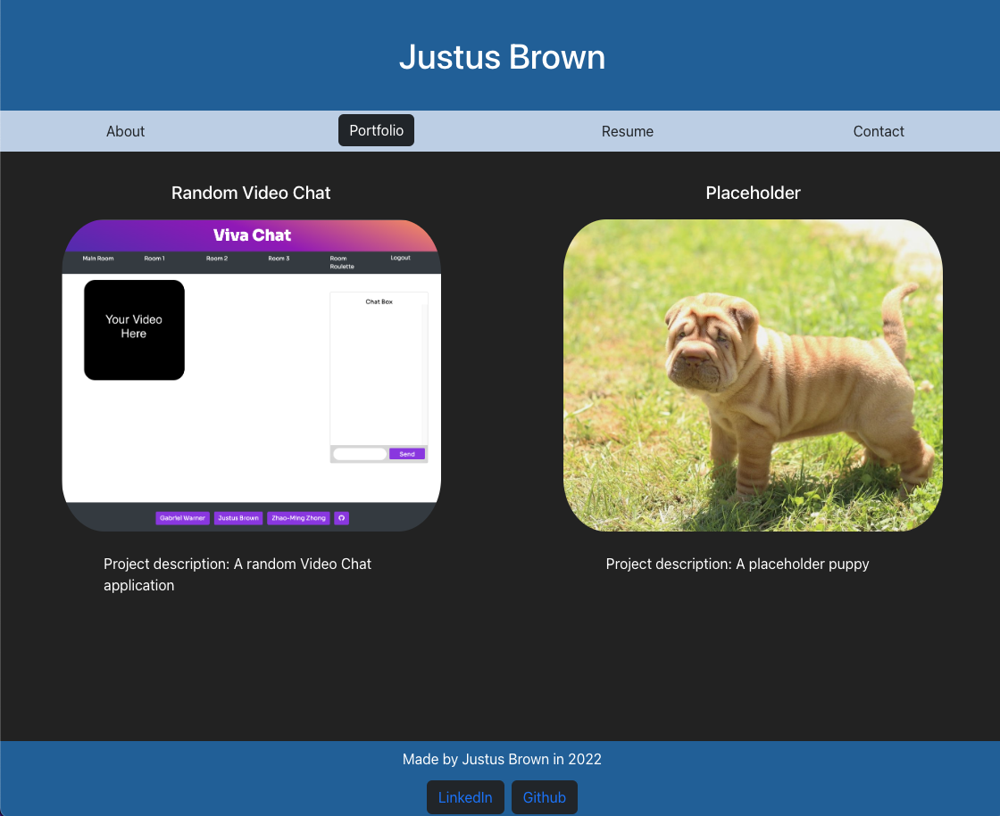

# Portfolio

## Description

This is my portfolio page. I built it using React.js because I wanted to showcase my projects in a concise and good looking format. It contains a short bio page, tiles showcasing my projects, a Resume page, and a (non-functional as of now) Contact form. 

Visit this (link)[https://brownj47.github.io/portfolio/] to see it deployed!

## Installation

If you would like to use my code as a basis for your own website, clone the repo, run 'npm i' in the root directory for the project, and then 'npm start'. There should now be a webpage live at http://localhost:3000/. 

## License

MIT License

Copyright (c) 2022 Justus Brown

Permission is hereby granted, free of charge, to any person obtaining a copy
of this software and associated documentation files (the "Software"), to deal
in the Software without restriction, including without limitation the rights
to use, copy, modify, merge, publish, distribute, sublicense, and/or sell
copies of the Software, and to permit persons to whom the Software is
furnished to do so, subject to the following conditions:

The above copyright notice and this permission notice shall be included in all
copies or substantial portions of the Software.

THE SOFTWARE IS PROVIDED "AS IS", WITHOUT WARRANTY OF ANY KIND, EXPRESS OR
IMPLIED, INCLUDING BUT NOT LIMITED TO THE WARRANTIES OF MERCHANTABILITY,
FITNESS FOR A PARTICULAR PURPOSE AND NONINFRINGEMENT. IN NO EVENT SHALL THE
AUTHORS OR COPYRIGHT HOLDERS BE LIABLE FOR ANY CLAIM, DAMAGES OR OTHER
LIABILITY, WHETHER IN AN ACTION OF CONTRACT, TORT OR OTHERWISE, ARISING FROM,
OUT OF OR IN CONNECTION WITH THE SOFTWARE OR THE USE OR OTHER DEALINGS IN THE
SOFTWARE.
